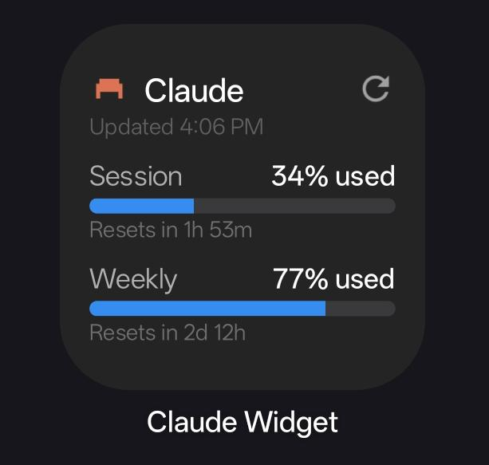
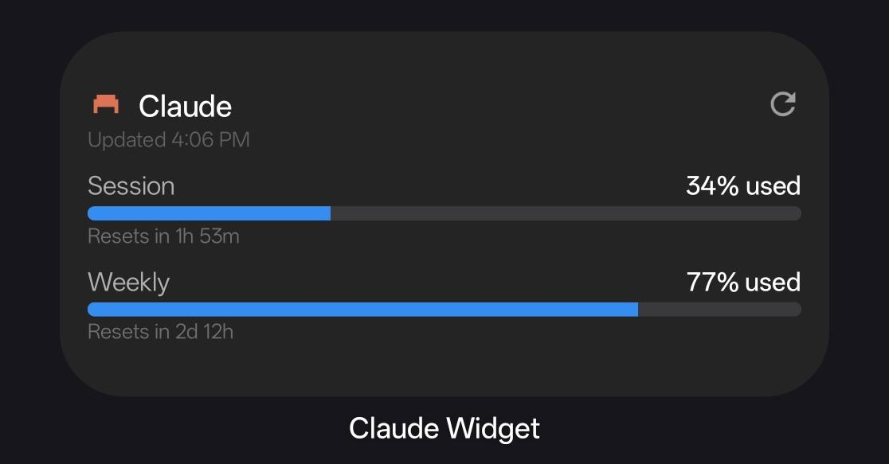

# AI Usage Widget

Android home screen widgets that track and display your real-time [Claude](https://claude.ai/) and [ChatGPT](https://chatgpt.com/) usage and remaining limits.
### Widget Previews
| 2x2 Compact Widget | 4x2 Wide Widget |
| :---: | :---: |
|  |  |

## Features
- **Real-Time Usage Tracking**: Displays your current Session limit usage and Weekly limit usage natively on your Android home screen.
- **Responsive Widget Layouts**: Automatically switches between a compact vertical layout and a horizontal wide layout depending on how you resize it. The widget is optimized for **2x2** and **4x2** sizes (with 2x2 being the default).
- **Auto-Refresh Integration**: Configurable background sync (via Android `WorkManager`) allows you to automatically fetch new usage data every 15m, 30m, 1h, 2h, 4h, or set it to "Never" for manual-only refreshes.
- **Instant Manual Refresh**: Tapping anywhere on the widget instantly triggers a one-shot sync and provides immediate "Refreshing..." visual feedback.
- **Smart Error Redirect**: If your session expires or encounters a network error, tapping the widget will automatically open the app so you can log back in.
- **Cloudflare & Google Auth Bypass**: Leverages a secure, in-app `WebView` for Google OAuth login. It dynamically extracts the required cookies (`cf_clearance`, `sessionKey`) and exact `User-Agent` to silently authenticate background API requests. Features a custom multi-window popup implementation to natively support Google Sign-In and smart session polling for instant login detection on Single Page Applications.

## Privacy & Security (Open Source)
Because this app requires you to log in to your Claude and/or ChatGPT account (which may have access to billing or private conversations), **security and trust are paramount.** 
- **100% Open Source:** The entire codebase is public. You are encouraged to audit the code (specifically `MainActivity.kt` and `UpdateWidgetWorker.kt`) to verify exactly how your credentials and cookies are handled.
- **No Third-Party Servers:** Your cookies and session data are stored **only** locally on your device using Android's private `SharedPreferences`. The app communicates *directly* with `claude.ai` and `chatgpt.com` to fetch your usage. It does not send your data, telemetry, or credentials anywhere else.

## Installation
1. Clone this repository:
   ```bash
   git clone https://github.com/john-gitdev/AIUsageWidgetForAndroid.git
   ```
2. Open the project in **Android Studio**.
3. Build the project and install the APK on your device.

## Usage
1. Open the **AI Usage Widget** app from your app drawer.
2. Pick the **Claude** or **ChatGPT** tab and log in (or use Google OAuth) via the secure in-app browser.
3. Once you see the "Connected!" screen, go to your home screen and add the **Claude Widget** or **ChatGPT Widget**.
4. You can re-open the app at any time to configure your **Auto Refresh Interval** or explicitly log out.

## Technical Notes
If you are interested in how the major technical hurdles were overcome (such as bypassing Cloudflare's bot protection, fixing Google OAuth WebView restrictions, or navigating Android's strict `RemoteViews` constraints), see the in-depth [Development Notes (notes.md)](notes.md) file.
